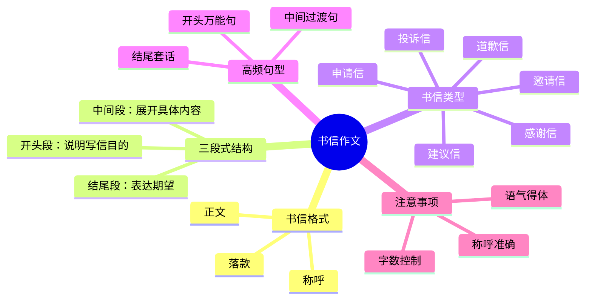

# CET-4：写作——书信作文模板与句型

> 📌 重构说明：本笔记将课堂录音中关于书信写作的内容按「书信格式 → 三段式结构 → 不同类型书信模板 → 高频句型 → 写作注意事项」的逻辑链重排，与现有书信作文笔记互为补充。

## 🧠 思维导图



---

## 一、书信格式

### 1.1 基本格式要素

英语书信作文的格式要求：

```markdown
Dear [称呼],

[正文内容]

Yours sincerely,
[签名]
```

### 1.2 称呼的写法

| 收信人 | 称呼 | 示例 |
|-------|------|------|
| 已知姓名 | Dear Mr./Ms. + 姓氏 | Dear Mr. Smith |
| 未知姓名 | Dear Sir or Madam | 正式场合使用 |
| 朋友/熟人 | Dear + 名字 | Dear Tom |
| 多收信人 | To whom it may concern | 非常正式 |

### 1.3 落款的写法

| 语气 | 落款 |
|-----|------|
| 正式 | Yours faithfully |
| 半正式 | Yours sincerely |
| 非正式 | Yours / Best wishes |

---

## 二、三段式结构

### 2.1 开头段：说明写信目的

开头段要**简明扼要**地说明写信的意图，通常1-2句话。

**常用句型**：
- I am writing to ...
- I am writing this letter to ...
- The purpose of this letter is to ...

### 2.2 中间段：展开具体内容

中间段是信件的核心，展开说明开头段提到的内容。

**投诉信**：说明问题 → 问题造成的影响 → 期望的解决方式
**建议信**：提出建议 → 建议的理由 → 期望的结果
**邀请信**：活动详情 → 邀请理由 → 期待回复

> [!tip] 技巧
> 中间段的展开可以使用 **First of all / Secondly / Finally** 等连接词使条理清晰。四级作文要求120-180词，中间段通常占60%-70%的篇幅。

### 2.3 结尾段：表达期望

结尾段通常表达对收信人的期待或感谢，1-2句话。

**常用句型**：
- I am looking forward to your reply.
- Thank you for your time and consideration.
- I would appreciate it if you could ...

---

## 三、常见书信类型模板

### 3.1 投诉信

```markdown
Dear Sir or Madam,

I am writing to express my dissatisfaction with [投诉对象].

[投诉对象] has caused [具体问题]. I have tried [已做的努力], but [未解决的情况].

I would appreciate it if you could [期望的解决方案]. I am looking forward to your early reply.

Yours sincerely,
Li Ming
```

### 3.2 建议信

```markdown
Dear [收信人],

I am writing to offer my suggestions on [建议主题].

First of all, it would be beneficial to [建议一] because [理由]. Secondly, I suggest that [建议二]. Finally, [建议三] would also help to improve [目标].

I hope my suggestions will be taken into consideration. Thank you for reading.

Yours sincerely,
Li Ming
```

### 3.3 邀请信

```markdown
Dear [收信人],

On behalf of [主办方], I am writing to invite you to [活动名称], which will be held on [时间] at [地点].

The event will feature [活动亮点]. We believe your presence would make the event even more successful.

We would be honored to have you with us. Please let us know if you can make it.

Yours sincerely,
Li Ming
```

---

## 四、高频句型汇总

### 4.1 开头句型

| 功能 | 句型 |
|-----|------|
| 投诉 | I am writing to complain about / express my dissatisfaction with |
| 建议 | I am writing to offer my suggestions on / propose that |
| 邀请 | I am writing to invite you to / on behalf of |
| 感谢 | I am writing to express my sincere gratitude for |
| 道歉 | I am writing to apologize for / express my regret about |
| 申请 | I am writing to apply for the position of |

### 4.2 中间过渡句型

| 功能 | 句型 |
|-----|------|
| 列举 | First and foremost / To begin with ... |
| 递进 | Moreover / Furthermore / What's more ... |
| 转折 | However / Nevertheless / On the other hand ... |
| 举例 | For instance / Take ... as an example |

### 4.3 结尾句型

| 语气 | 句型 |
|-----|------|
| 期待回复 | I am looking forward to your reply at your earliest convenience |
| 感谢 | Thank you for your time and consideration |
| 请求 | I would greatly appreciate it if you could ... |
| 通用 | Please do not hesitate to contact me if you have any questions |

---

## 五、写作注意事项

1. **语气得体**：投诉信要礼貌，建议信要委婉，邀请信要热情
2. **称呼准确**：已知姓名用Dear Mr./Ms. + 姓氏，未知用Dear Sir or Madam
3. **字数控制**：四级作文要求120-180词，书信体不要过长
4. **段落分明**：每段一个中心，段与段之间逻辑清晰
5. **避免语法错误**：注意主谓一致、时态统一、冠词用法
6. **书写工整**：卷面分不可忽视

---

## 🔗 知识网络

### 前置依赖
- [[英语四级写作]] — 写作部分的基本要求
- [[英语四级词汇]] — 写作词汇积累

### 后续延伸
- [[书信作文模板与写法]] — 现有书信作文笔记
- [[议论文框架]] — 另一类高频考察文体
- [[三大论证方式]] — 论证方法补充

### 对比辨析
- 书信作文（信件格式） vs 议论文（论点+论据+论证）：格式完全不同，书信要写称呼和落款
- 投诉信（表达不满） vs 建议信（提出方案）：前者侧重问题陈述，后者侧重方案展开

---

## 📚 核心词条索引

| 知识点链接 | 类别 | 关键词 |
|------|------|--------|
| [[三段式结构]] | 写作框架 | 开头→中间→结尾 |
| [[书信格式]] | 写作规范 | 称呼+正文+落款 |
| [[投诉信模板]] | 书信类型 | 表达不满+期望解决 |
| [[建议信模板]] | 书信类型 | 提出建议+说明理由 |
| [[邀请信模板]] | 书信类型 | 邀请参与+告知详情 |