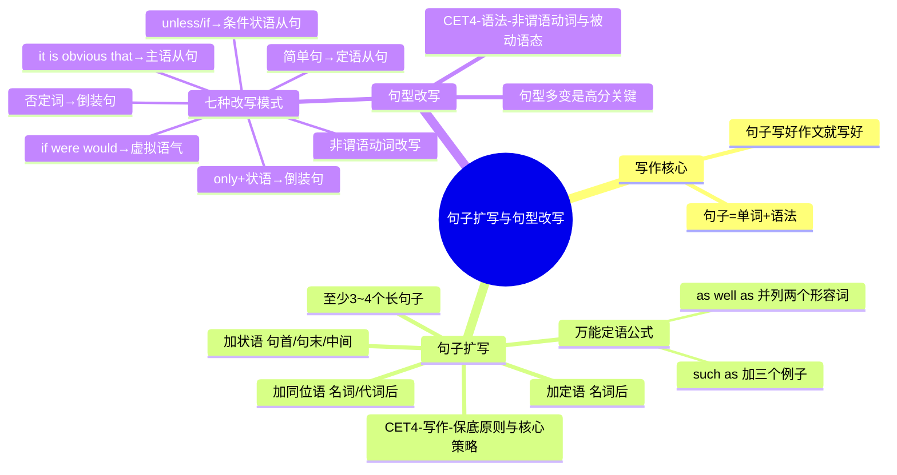

# CET-4：句子扩写与句型改写

> 📌 重构说明：本笔记将所有课堂句子扩写实例（4个完整扩写案例 + 万能定语公式 + 万能状语 + 句型改写7种模式）汇总为完整技术手册，是写作提分最核心的技能模块。

## 🧠 思维导图



---

## 一、句子拉长三要素

> ==核心原则：在不改变主句句意的前提下，巧妙地增补细节信息，让句子瞬间丰满。==

| 添加成分 | 添加位置 | 作用 |
|---|---|---|
| **定语（Attributive）** | 名词后 | 修饰名词 |
| **同位语（Appositive）** | 名词/代词后 | 补充说明 |
| **状语（Adverbial）** | 句首 / 句末 / 主谓之间 | 补充时间/地点/原因/伴随等 |

> [!warning] ⚠️ 一句话中，加了定语就别加同位语，加了同位语就别加定语（避免重复堆砌）。如果有两个名词，可以一个加定语、一个加同位语。

---

## 二、完整扩写案例（4个标准范例）

### 案例1：I love Dayan（基础句3词 → 扩写15词+）

| 步骤 | 添加内容 | 类型 |
|---|---|---|
| 原句 | I love Dayan. | 主谓宾 |
| 加同位语 | I, **a college student from Physical Education**, love Dayan. | 代词后加同位语 |
| 加定语从句 | ...love Dayan, **who is the most gorgeous and elegant teacher I have ever seen**. | 名词后加定语从句 |

> 最终句：I, a college student from Physical Education, love Dayan, who is the most gorgeous and elegant teacher I have ever seen.

---

### 案例2：网络暴力游戏可能让孩子变得暴力（9词 → 20词+）

| 步骤 | 添加内容 | 类型 |
|---|---|---|
| 原句 | Violent online games may make children become violent. | 主谓宾+宾补 |
| 加定语 | Violent online games, **which are popular everywhere online**,... | 名词后加非限制性定语从句 |
| 加地点状语 | ...may make children become violent **in their daily lives** | 句末加地点状语 |
| 加原因状语 | ...**because children tend to imitate these negative behaviors**. | 句末加原因状语从句 |

> [!warning] ⚠️ 注意单词多变：前面用了 violent，后面换用 negative behaviors，避免重复用词。

---

### 案例3：污染一直很严重（3词 → 20词+）

| 步骤 | 添加内容 | 类型 |
|---|---|---|
| 原句 | Pollution remains serious. | 主系表 |
| 加同位语 | Pollution, **a global issue**, remains serious... | 名词后加同位语 |
| 加伴随状语 | **With the rapid progress of urbanization and industrialization**, pollution... | 句首加伴随状语 |
| 加地点状语 | ...remains serious **not only in China but also in other countries worldwide**. | 句末加地点状语 |

---

### 案例4：读书能够开阔眼界

| 步骤 | 添加内容 | 类型 |
|---|---|---|
| 原句 | Reading books can broaden horizons. | 主谓宾 |
| 加定语 | Reading books **that are beneficial to both mental and physical health**... | 名词后加定语从句 |
| 加定语 | can broaden **young people's** horizons | 加 young people's |
| 加时间状语 | **In our spare time**, reading books...can broaden... | 句首加时间状语 |

> 替代方案：用万能定语公式 → Reading books, **such as Journey to the West, My Mother, and The Old Man and the Sea**, can broaden...

---

## 三、两个万能定语公式

### 公式一：`as well as` 并列两个形容词

> ==用于修饰单数名词，放在名词后==

| 模板 | `N + , + adj1 + as well as + adj2` |
|---|---|

**实例**：

| 你想写 | 万能用法 |
|---|---|
| 我爱美丽善良的大雁 | I love Dayan, **beautiful as well as kind**. |
| 养可爱聪明的宠物 | Keeping pets, **cute as well as smart**. |
| 读有趣有意义的书 | Reading books, **interesting as well as meaningful**. |

> [!warning] **考点**: 加逗号 = 非限制性定语；不加逗号 = 限制性定语。

### 公式二：`such as` 加三个例子

> ==用于修饰复数名词，放在名词后==

| 模板 | `N-s + such as + N1, N2 and N3` |
|---|---|

**实例**：

| 你想写 | 万能用法 |
|---|---|
| 我喜欢养宠物 | I enjoy keeping pets, **such as dogs, fishes and cats**. |
| 我喜欢吃水果 | I like eating fruits, **such as apples, bananas and oranges**. |
| 我有很多爱好 | I have lots of hobbies, **such as swimming, traveling and reading books**. |

> [!warning] **考点**: such as 后面接名词复数形式，三个例子用逗号和 and 连接。

---

## 四、状语万能加法

> 状语位置最灵活：句首 / 句末 / 主谓之间均可插入。

| 状语类型 | 常用表达 | 示例 |
|---|---|---|
| 时间 | in our spare time / nowadays / recently | **In our spare time**, reading can broaden horizons. |
| 伴随 | with the rapid development of... | **With the rapid progress of urbanization**, pollution... |
| 原因 | because / due to / owing to | ...make children violent **because they tend to imitate...** |
| 地点 | in China / on campus / in their daily lives | ...remains serious **not only in China but also worldwide**. |
| 插入语 | in my deep heart / personally / however | I, **in my deep heart**, love Dayan. |

---

## 五、句型改写七种模式

### 核心概念

> 同一个意思可以用不同的句式来表达。一篇文章不能全部是主谓宾，必须做到「句型多变」。

### 七种模式对照表

以「我绝不嫁给你」为练习句：

| 序号 | 句型 | 例句 | 构造方法 |
|---|---|---|---|
| 1 | 简单句 | **I will never marry you.** | 最基础写法 |
| 2 | 定语从句 | **You are the man that I will never marry.** | 把宾语变成被修饰名词 |
| 3 | 倒装句（否定词） | **Never will I marry you.** | 否定词置于句首 → 倒装 |
| 4 | 倒装句（only+状语） | **Only in two years will I marry you.** | Only + 状语 置句首 → 倒装 |
| 5 | 主语从句 | **It is obvious that I will never marry you.** | 前面加 it is + adj + that... |
| 6 | 条件状语从句 | **I will not marry you unless the sun rises in the west.** | unless / if 引导条件 |
| 7 | 虚拟语气 | **If you were the last man in the world, I would become a nun.** | If...were..., ...would... |

### 倒装句秘诀

> ==只要有状语，就可以用 only + 状语 放在句首，然后倒装。==

```
Only in two years will I marry you.
Only by reading widely can we broaden our horizons.
Only in this way can we solve the problem.
```

### 虚拟语气秘诀

> ==对现在/将来的假设：If + 主语 + were/did..., 主语 + would/could/might + 动词原形...==

> [!warning] ⚠️ 虚拟语气是写作和翻译的满分句型，但必须用对：前半截假设（if...were/did），后半截结果（would do），缺一不可。10-12分档最常见错误就是"前半截续了，后半截没续"。

---

## 六、扩写与改写的选择策略

> ==一篇150词的作文==
>
> - 第一段：2句话（引出话题 + 个人观点）
> - 第二段：4-5句话（原因分析 + 论证）
> - 第三段：2句话（总结 + 行动建议）
>
> ==总共约8-9句话，其中至少3-4句应该是15-20词的长句。==

| 位置 | 建议用法 |
|---|---|
| 第一段 | 引出话题句用 **with + 伴随状语** 扩写；个人观点句用 **from my perspective / as far as I'm concerned** |
| 第二段 | 每个原因的句子都加 **定语/状语/同位语** 拉长；论证方式句用 **which 非限制性定语从句** 追加 |
| 第三段 | 总结句前加 **In conclusion / To sum up**；行动建议用 **it is necessary that... (should) do** |

### 课堂核心句积累（背诵材料）

> 以下句子来自课堂，建议熟读背诵培养语感。

1. **引出话题万能句**：With the unprecedentedly rapid development of..., this phenomenon has been brought into the limelight.
2. **个人观点万能句**：From my perspective, ... has exerted a profound impact on people's lives.
3. **分类论证总起句**：Superficially, it seems to be a simple phenomenon, but when analyzing it carefully, it has profound reasons.
4. **正面结果追加句**：(which) in turn enables them to make greater progress in their personal and professional development.
5. **条件倒装句**：Only by developing effective social skills will they express their ideas clearly and cooperate effectively in teams.

---

---

## 🔗 知识网络

### 前置依赖
- [[CET4-写作-保底原则与核心策略]] — 写作的基本要求
- [[CET4-写作-议论文框架]] — 议论文的整体结构

### 后续应用
- [[CET4-语法-非谓语动词与被动语态]] — 非谓语动词在扩写中的应用
- [[CET4-写作-书信与应用文]] — 书信中的句型变化

### 对比辨析
- 扩写 vs 改写：扩写是增加修饰成分使句子更丰富（定语/状语/同位语），改写在保持原意前提下换用不同表达（同义替换）
- 简单句 vs 复合句：简单句表达清晰但平淡，复合句（定语从句/名词性从句）信息量大且体现语法能力

## 📚 核心词条索引
