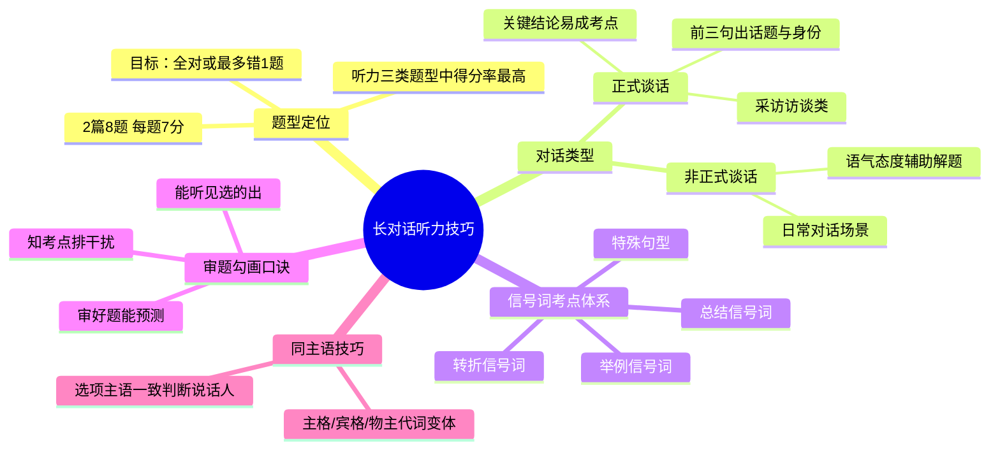

# CET-4：长对话听力——信号词体系与真题技巧

> 📌 重构说明：本笔记将多段课堂录音中关于长对话听力的内容合并，按「题型定位与分数策略 → 对话类型特征 → 信号词考点体系 → 审题勾画技巧 → 真题带练分析」的逻辑链重排，作为现有长对话笔记的实战技巧补充。

## 🧠 思维导图



---

## 一、题型定位与分数策略

### 1.1 长对话的基本数据

- 共 **2篇**，每篇约250-300词
- 每篇 **4题**，共 **8题**
- 每题分值约 **7分**（总分710分中听力占248.5分）

> [!warning] 考点
> ⚠️ 长对话是听力三板块中得分率最高的题型，目标应该是全对或最多错1题。相比短篇新闻（语速快且内容陌生）和听力篇章（篇幅长细节多），长对话的日常性最强，最易得分。

### 1.2 难易度规律

- 第一篇对话通常比第二篇简单
- 对话前半部分（前3-4轮对话）通常比后半部分简单
- 提问一般按对话顺序排列（第一题对应对话开头）

---

## 二、对话类型与特征

### 2.1 正式谈话

**采访/访谈类**：

- 对话中通常有一人提问（记者/面试官），另一人回答（受访者/应聘者）
- **前三句出主题**：开场白通常会交代对话背景和人物身份
- 话题各侧面转换后会有归纳总结
- 关键结论容易成为考点

### 2.2 非正式谈话

**日常对话**（学习、工作、生活场景）：

- 表达简洁，难词少
- 一男一女角色扮演，情景演绎
- 语调态度可辅助判断真实意图
- 可通过语气判断说话人的观点倾向（赞同/反对/怀疑）

### 2.3 对话角色特征

- 对话通常为一男一女扮演，可借此判断说话人
- 一方提出话题，另一方回应
- 性格对话通常体现为询问方和回答方的互动

---

## 三、信号词考点体系

信号词是听力中**最核心的技巧**，信号词前后通常是答案出现的位置。

### 3.1 转折信号词

> 转折信号词后面往往是**重点信息或正确答案**。

| 信号词 | 用法特征 |
|-------|---------|
| but | 最常见的转折词，but后出考点 |
| however | 正式程度较高，引出相反观点 |
| yet | 表示出乎意料的转折 |
| actually | 引出真实情况或修正上文 |
| in fact | 强调事实，与预期相反 |
| on the other hand | 引出另一面观点 |

### 3.2 总结信号词

> 总结信号词后面往往是**结论或建议**。

| 信号词 | 用法特征 |
|-------|---------|
| so / therefore | 引出因果关系中的结果 |
| thus | 较正式的总结 |
| consequently | 引出结果或推论 |
| in a word | 一句话总结上文 |
| after all | 毕竟，引出重要原因 |

### 3.3 举例信号词

> 举例信号词后面往往是**对抽象概念的具体说明**。

| 信号词 | 用法特征 |
|-------|---------|
| for example | 最常见的举例 |
| for instance | 同上，较正式 |
| such as | 引出具体例子 |
| like | 口语化举例 |

### 3.4 特殊句型

> 某些特殊句型本身即为考点信号。

- **强调句**：It is ... that ...（强调的内容即为答案）
- **建议句型**：Why not ...? / How about ...? / You should ...
- **最高级**：the most / the best / the worst（最高级处出考点）
- **首次提及**：对话中首次提到的重要概念

---

## 四、审题勾画技巧

### 4.1 审题勾画口诀

```
审好题  能预测
能听见  选的出
知考点  排干扰
```

- **审好题**：利用direction时间快速浏览选项
- **能预测**：通过选项推测对话主题和提问方式
- **能听见**：带着预测去听，有方向地抓取信息
- **选的出**：听到答案能快速判断
- **知考点**：了解常考的信号词位置
- **排干扰**：排除与原文不符的干扰项

### 4.2 同主语技巧

当四个选项的主语不一致时（如A选项以he开头，B选项以she开头），可以通过主语判断应该听哪一位说话人的内容。

- 选项主语为 **he** → 重点听 **男性** 说话人的内容
- 选项主语为 **she** → 重点听 **女性** 说话人的内容
- 注意**主格/宾格/物主代词**的变体（he/him/his，she/her/hers）

---

## 五、长对话备考建议

1. **精听与泛听结合**：每套真题至少精听2-3遍
2. **信号词敏感训练**：在听听力时专门标记信号词位置
3. **对话场景归类**：将遇到的对话按场景分类（校园、工作、生活等）
4. **错题分析**：分析错题是因为没听到信号词还是选项理解错误

---

## 🔗 知识网络

### 前置依赖
- [[英语四级听力]] — 听力部分的基础要求
- [[英语四级词汇]] — 听力词汇的掌握

### 后续延伸
- [[英语四级新闻听力]] — 长对话之后的进阶题型
- [[英语四级篇章听力]] — 篇幅更长的听力篇章

### 对比辨析
- 长对话（2人日常/采访） vs 短新闻（1人播报） vs 篇章（1人讲述学术内容）

---

## 📚 核心词条索引

| 知识点链接 | 类别 | 关键词 |
|------|------|--------|
| [[信号词]] | 核心技巧 | 提示答案位置的关键词 |
| [[转折信号词]] | 信号词类型 | but, however, yet等 |
| [[长对话]] | 听力题型 | 2篇8题，日常对话场景 |
| [[审题勾画]] | 考试技巧 | 利用direction时间浏览预测 |
| [[同主语技巧]] | 考试技巧 | 根据选项主语判断听谁说话 |