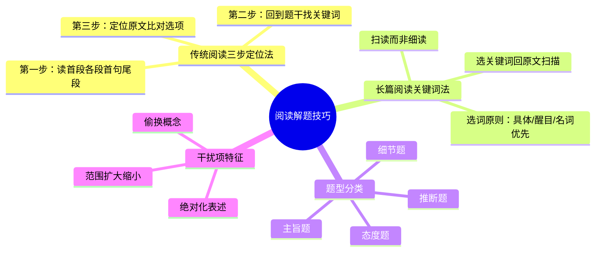

# CET-4：阅读——三步定位法与题型分类

> 📌 重构说明：本笔记将多段课堂录音中关于传统阅读和长篇阅读的内容合并，按「传统阅读三步定位法 → 长篇阅读关键词定位 → 主旨题与细节题分类辨析」的逻辑链重排，补充了现有阅读笔记中的实战技巧和口诀。

## 🧠 思维导图



---

## 一、传统阅读三步定位法

### 1.1 三步法总览

传统阅读（仔细阅读）是四级阅读中最重要的题型，共两篇，每篇5题，占总分20%。


**第一步：通读框架（约30秒）**
- 读完 **首段**，理解文章主题
- 快速浏览 **每段首句**，把握文章结构
- 读完 **尾段**，了解结论或总结

> 注意：这一步不是精读，而是快速扫描，目的是了解文章「讲了什么」和「怎么讲的」。

**第二步：题干定位**
- 回到题干，**划出关键词**（专有名词、数字、独特概念等）
- 带着关键词回原文定位
- 通常按出题顺序定位（四级阅读题目一般按文章顺序排列）

**第三步：比对答案**
- 定位到原文后，与选项进行**精细比对**
- 正确答案通常是原文的**同义替换**
- 排除干扰项

### 1.2 实战口诀

```
首段各段首句尾段——把握框架
题干关键词回原文——精准定位
同义替换是答案——排除干扰
```

---

## 二、长篇阅读关键词定位法

### 2.1 题型特征

长篇阅读（匹配题/段落信息匹配）共1篇，约1000词，10道题。

- 文章长但题目难度相对较低
- 不需要完全理解文章，关键在于**快速定位**
- 10个句子匹配10个段落（部分段落不匹配或一个段落匹配多题）

### 2.2 关键词选择原则

**选词原则**：具体、醒目、名词优先

| 关键词类型 | 优先级 | 示例 |
|-----------|-------|------|
| 专有名词 | ⭐⭐⭐ | 人名、地名、机构名 |
| 数字/时间 | ⭐⭐⭐ | 年份、百分比、金额 |
| 独特名词/概念 | ⭐⭐ | 特定术语、不常见的名词 |
| 形容词+名词组合 | ⭐⭐ | 较长且具体的修饰组合 |
| 动词/抽象名词 | ⭐ | 容易同义替换，不优先选 |

> [!tip] 技巧
> 优先选择**不容易被同义替换**的词作为关键词。专有名词和数字是最佳选择，因为它们通常保持原样出现。动词和抽象形容词最容易在原文中被替换。

### 2.3 扫读技巧

- **扫读而非细读**：眼睛快速扫过段落，寻找关键词
- 不需要逐词阅读，只寻找与关键词匹配的词
- 找到匹配后，再仔细阅读该句前后确认
- 先做容易定位的题，难题最后处理

---

## 三、题型分类与解题策略

### 3.1 主旨题

**提问方式**：What is the main idea of the passage? / The passage mainly discusses ...

**解题策略**：
1. 重点关注首段和尾段
2. 注意全文反复出现的核心概念
3. 排除过宽或过窄的选项

### 3.2 细节题

**提问方式**：According to the passage, ... / What does the author say about ...

**解题策略**：
1. 精确回原文定位
2. 注意同义替换
3. 警惕偷换概念（如将A的特点移给B）

### 3.3 推断题

**提问方式**：What can be inferred from ... / It can be concluded that ...

**解题策略**：
1. 答案在原文中**没有直接出现**
2. 需要根据原文信息进行合理推断
3. 排除与原文矛盾的选项

### 3.4 态度题

**提问方式**：What's the author's attitude towards ... / The tone of the passage is ...

**解题策略**：
1. 关注表示情感色彩的形容词和副词
2. 区分正面、负面、中立态度
3. 注意转折词后的态度变化

### 3.5 干扰项特征

| 干扰类型 | 特征 | 应对方法 |
|---------|------|---------|
| 偷换概念 | 选项中出现与原文相似但不同的概念 | 精确比对每一个名词 |
| 范围扩大/缩小 | 将原文的部分情况扩大到全体/反之 | 注意限定词 |
| 绝对化表述 | 出现all, never, always等绝对词 | 通常为错误选项 |
| 无中生有 | 原文未提及的信息 | 严格依据原文 |

---

## 🔗 知识网络

### 前置依赖
- [[英语四级词汇]] — 阅读词汇量要求
- [[英语四级阅读]] — 阅读部分基本要求

### 后续延伸
- [[仔细阅读泛读与主旨定位]] — 现有阅读笔记的详细方法
- [[选词填空题解题策略]] — 选词填空的专项技巧

### 对比辨析
- 传统阅读（细读1篇文章+5题） vs 长篇阅读（匹配10句与段落）
- 主旨题（问整体） vs 细节题（问局部）

---

## 📚 核心词条索引

| 知识点链接 | 类别 | 关键词 |
|------|------|--------|
| [[三步定位法]] | 核心技巧 | 通读框架→题干定位→比对答案 |
| [[关键词定位]] | 核心技巧 | 选具体醒目名词回原文扫读 |
| [[同义替换]] | 核心考点 | 正确选项与原文的对应关系 |
| [[干扰项排除]] | 核心技巧 | 偷换概念/绝对化/无中生有 |
| [[扫读技巧]] | 阅读方法 | 快速扫描寻找关键词 |