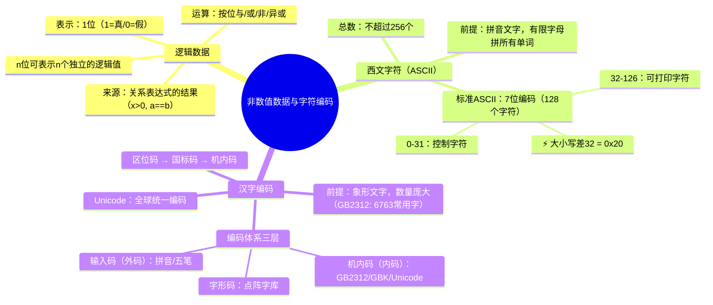

# 非数值数据与字符编码

> 📌 重构说明：本笔记聚焦计算机中**非数值型数据**的编码——逻辑值、西文字符（ASCII）、汉字编码。老师从「按一下键盘上的字母，计算机里到底发生了什么」这一生动的提问出发，逐步展开三类非数值数据的编码体系。

---

## 🧠 思维导图



---

## 第一部分：回顾数据分类框架

### 一、两大类数据

> 老师原话：「第二章讲到计算机里面的数据分为两大类。第一大类是数值型数据，包含整数和浮点数。还有一类叫非数值数据。」

```
计算机中的数据
├── 数值型数据 → 06_数值数据的编码_原码反码补码
│    ├── 整数（无符号 / 带符号）
│    └── 浮点数
└── 非数值数据 → 【本笔记】
     ├── 逻辑数据
     ├── 西文字符（ASCII）
     └── 汉字
```

---

## 第二部分：逻辑数据

### 二、什么是逻辑数据？

> 📖 标准定义：逻辑数据用来表示关系表达式（如 `x > 0`、`a == b`）的结果——命题的**真**或**假**。在计算机中，用 **1 位二进制**表示：1 代表真（True），0 代表假（False）。

### 三、老师课堂举例——从 C 语言的 if 条件出发

> 老师原话：「大家在编程的时候，`if (a > 0)` 这个 `a > 0` 最后产生的结果其实就是一个逻辑数据——它只用来表示这个命题是**真**还是**假**。」

**复合表达式中的逻辑值：**

```c
if (x > 0 && y <= 0) {  // 这里面产生了三个逻辑值！
    ...
}
```

这个表达式里悄悄产生了**三个**逻辑值：

||||子表达式|命题|结果类型|
||||----------|------|----------|
||||`x > 0`|x 是否大于 0|逻辑值（真/假）|
||||`y <= 0`|y 是否小于等于 0|逻辑值（真/假）|
||||`(x>0) && (y<=0)`|两个逻辑值的与运算|逻辑值（真/假）|

### 四、多位的逻辑数据表示

> 老师强调：「一个 n 位的二进制数，它可以表示 **n 个逻辑结果**。」

例如，1 个字节（8 位）可以同时存储 8 个独立的布尔标志，这在嵌入式编程中的**标志寄存器**中非常常见：

```
位号:  7   6   5   4   3   2   1   0
标志:  [1] [1] [0] [0] [1] [0] [1] [1]
       开  开  关  关  开  关  开  开
```

### 五、逻辑运算——按位操作

||||运算|符号|真值表|说明|
||||------|------|--------|------|
||||**按位与**|`&`|11→1, 其他→0|两个均为1才得1|
||||**按位或**|`|`|00→0, 其他→1|任一为1就得1|
||||**按位非**|`~`|1→0, 0→1|逐位取反|
||||**按位异或**|`^`|相同→0, 不同→1|「判断不同位」|
||||**左移**|`<<`|高位丢弃，低位补 0|每左移 1 位 = × 2|
||||**右移**|`>>`|低位丢弃，高位补 0 或符号位|每右移 1 位 = ÷ 2|

详见 08_数据运算与位操作 的深入展开。

---

## 第三部分：西文字符编码（ASCII）

### 六、核心前提：西文是拼音文字

> 老师原话：「西文字符的特点是一种拼音文字，它用有限几个字母可以拼出所有单词。所以我们只需要对有限个字母和符号进行编码就可以了。」

||||字符类别|数量|
||||----------|------|
||||大写字母 A~Z|26|
||||小写字母 a~z|26|
||||数字 0~9|10|
||||标点符号|约 30|
||||特殊控制字符|约 30|
||||**总计**|**不超过 256 个**|

结论：所有西文字符的**总数不超过 256 个**，所以用 **7 位或 8 位**二进制就足够编码（$2^7 = 128$，$2^8 = 256$）。

### 七、ASCII 码表——必记的关键码值

> [!warning] 考点
> ⚠️ 以下 ASCII 码值是考试高频内容，必须记住

#### 7.1 控制字符（0 ~ 31）

||||十进制|十六进制|符号|含义|
||||--------|----------|------|------|
||||0|0x00|NUL|空字符|
||||10|0x0A|LF|换行（Line Feed）|
||||13|0x0D|CR|回车（Carriage Return）|

#### 7.2 关键可打印字符

||||字符|十进制码值|十六进制码值|记忆口诀|
||||------|-----------|-------------|----------|
||||**空格**|**32**|0x20|可打印字符的最小值|
||||**'0'**|**48**|0x30|0 的 ASCII 码 = 48|
||||**'A'**|**65**|0x41|A 的 ASCII 码 = 65|
||||**'a'**|**97**|0x61|a 的 ASCII 码 = 97|

#### 7.3 大小写字母的规律关系

> [!warning] 考点
> ⚠️ 同一个字母的大写和小写 ASCII 码**正好差 32**（= 0x20）

$$
\text{小写} - \text{大写} = 32
$$

**实例：**
```
'A' = 65  →  'a' = 65 + 32 = 97
'B' = 66  →  'b' = 66 + 32 = 98
'D' = 68  →  'd' = 68 + 32 = 100
```

**编程应用**——转小写为转换 ASCII 码值：
```c
// 大写转小写
char lower = 'D' + 32;   // lower = 'd' = 100

// 或使用位运算（第 5 位置 1）
char lower = 'D' | 0x20; // 'D' (01000100) → 'd' (01100100)
```

---

## 第四部分：汉字编码

### 八、核心前提：汉字是象形文字

||||对比维度|西文字符|汉字|
||||----------|----------|------|
||||**文字类型**|拼音文字|象形/表意文字|
||||**基本单元数量**|26 个字母|数千个独立汉字|
||||**编码所需位数**|7~8 位（1 字节）|至少 14~16 位（2 字节）|
||||**常用字符集**|128 (ASCII)|GB2312: 6763 个常用字|
||||**国家/国际标准**|ASCII|GB2312 / GBK / GB18030 / Unicode|

### 九、汉字编码的三层体系

老师用「你打字到屏幕显示」的完整流程来解释这三层编码：

```
键盘输入（拼音/wubi）
    ↓ 输入码
机内存储（GB2312/GBK/Unicode 编码）
    ↓ 机内码
屏幕显示/打印（点阵字库）
    ↓ 字形码
```

||||编码层|别称|作用|例|
||||--------|------|------|-----|
||||**输入码**|外码|将汉字输入计算机|拼音码、五笔字型|
||||**机内码**|内码|在计算机内部存储和传输|GB2312、GBK、Unicode|
||||**字形码**|输出码|控制汉字在屏幕或打印机上的形状|16×16 点阵、矢量字库|

#### 9.1 字形码的工作方式——点阵字库

以 16×16 点阵为例：每个汉字用 16 行 × 16 列 = 256 个像素点表示。

```
  ●●●●●●●●●●●●●●●●
  ●●●●●●●●●●●●●●●●
  ●●          ●●
  ●●          ●●
  ●●          ●●
  ●●          ●●
  ●●          ●●
  ●●          ●●
  ●●          ●●
  ●●          ●●
  ●●          ●●
  ●●          ●●
  ●●          ●●
  ●●          ●●
  ●●●●●●●●●●●●●●●●
  ●●●●●●●●●●●●●●●●
  （16×16 = 256点，每点1位 → 每字 32 字节）
```

||||点阵大小|横向点数|纵向点数|每字存储量|
||||----------|---------|---------|-----------|
||||16×16|16|16|16×16÷8 = 32 字节|
||||24×24|24|24|24×24÷8 = 72 字节|
||||32×32|32|32|32×32÷8 = 128 字节|

**矢量字库**（现代主流方式）用数学曲线（贝塞尔曲线）描述字形轮廓，无论放大多少倍都不会产生锯齿。

### 十、GB2312 的编码结构

> [!info] 补充定义
> **GB2312**（国标2312-80）是中国制定的第一个汉字编码国家标准，收录 6763 个常用汉字和 682 个其他符号。每个字符用 **2 个字节**表示。

**区位码 → 国标码 → 机内码的转换：**

||||编码|计算方式|例子（汉字「中」）|
||||------|----------|-------------------|
||||区位码|区号（行）+ 位号（列）|54 区 48 位|
||||国标码|区号+20H，位号+20H|56H 50H|
||||**机内码**|**国标码每字节 + 80H**|**D6H D0H**|

> [!warning] 考点
> ⚠️ 关键规律：机内码 = 国标码 + 8080H，**机内码的两个字节最高位都是 1**，这样就能与 ASCII 码（最高位为 0）区分开来。

### 十一、Unicode——全球统一编码

||||编码方式|字节数|包含字符|使用场景|
||||----------|--------|----------|----------|
||||GB2312|2 字节|中文简体|中国早期软件|
||||GBK|2 字节|中文简繁体 + 日韩|Windows 中文版|
||||GB18030|1/2/4 字节|全部 Unicode 字符|中国国家标准|
||||UTF-8|1~4 字节|全球所有字符|Web、Linux|
||||UTF-16|2/4 字节|全球所有字符|Windows 内核|

> [!info] 补充定义
> **UTF-8** 是 Unicode 的变长编码方案。ASCII 字符用 1 字节（与 ASCII 兼容），大部分汉字用 3 字节。它是互联网上使用最广泛的字符编码。

---

## 第五部分：综合对比——四种编码方法汇总

||||数据类型|编码方法|位数|核心特点|
||||----------|----------|------|----------|
||||**逻辑数据**|1 位直接表示|1 bit|简单直接，n 位可存 n 个逻辑值|
||||**西文字符**|ASCII|7/8 bit (1 B)|不超过 256 个字符，'A'=65, 'a'=97|
||||**汉字**|GB2312/Unicode|16+ bit (≥2 B)|机内码最高位都为 1|
||||**数值整数**|补码|8/16/32/64 bit|零唯一，减法变加法|

---

## 第五部分：编码实战——程序员每天面对的问题

### 十二、乱码是怎么产生的？

> [!warning] 考点
> ⚠️ 理解乱码的根源——用错了编码去解读字节串。

乱码 = 按编码 A 写入，按编码 B 读出。

```
写入（UTF-8）:  "你好" → [E4 BD A0] [E5 A5 BD]
读出（GBK）:    [E4 BD] → "浣"  [A0 E5] → "犲"  [A5 BD] → "ソ"
显示:           "浣犲ソ" ← 这就是乱码！
```

**例子**：同一段文字用不同编码解读：

||||编码方式|解读结果|说明|
||||----------|---------|------|
||||UTF-8 写入 → UTF-8 读取|你好|✅ 正常|
||||UTF-8 写入 → GBK 读取|浣犲ソ|❌ 乱码|
||||GBK 写入 → UTF-8 读取|锟斤拷|❌ 经典乱码符号|

#### 12.1 「锟斤拷」的由来

> 最经典的乱码案例——当 UTF-8 解析器遇到无效字节时，会插入替换字符 `U+FFFD`（），而 `U+FFFD` 的 UTF-8 编码是 `EF BF BD`。如果这些字节被后续用 GBK 解读，就会变成「锟斤拷」三个字。

### 十三、BOM（字节序标记）

||||BOM|对应编码|字节序列|
||||-----|----------|---------|
||||UTF-8|EF BB BF|Windows 记事本写入 UTF-8 时常加开头|
||||UTF-16 LE|FF FE|小端序|
||||UTF-16 BE|FE FF|大端序|

> [!warning] 考点
> ⚠️ 若用记事本保存含中文的源代码为 UTF-8 with BOM，编译器可能因开头的 BOM 字节而报错。

### 十四、编程中常见编码问题

**问题 1**：跨平台中文文件
```python
# Windows 上创建的 GBK 文件在 Linux (UTF-8) 上打开会乱码
with open('file.txt', 'r', encoding='utf-8') as f:  # 错！
with open('file.txt', 'r', encoding='gbk') as f:    # 正确
```

**问题 2**：数据库字符集不匹配
```sql
-- 若数据库使用 latin1 而插入中文，数据会损坏
-- 解决方案：CREATE DATABASE db DEFAULT CHARACTER SET utf8mb4;
```

**问题 3**：URL 中的中文编码
```
原始:  https://example.com/搜索?q=计算机
编码后: https://example.com/%E6%90%9C%E7%B4%A2?q=%E8%AE%A1%E7%AE%97%E6%9C%BA
```

> 浏览器会自动将中文转换为 URL 编码（百分号 + 十六进制 UTF-8 字节），这是另一个实际编码应用。

---

> 📂 所属分类：
