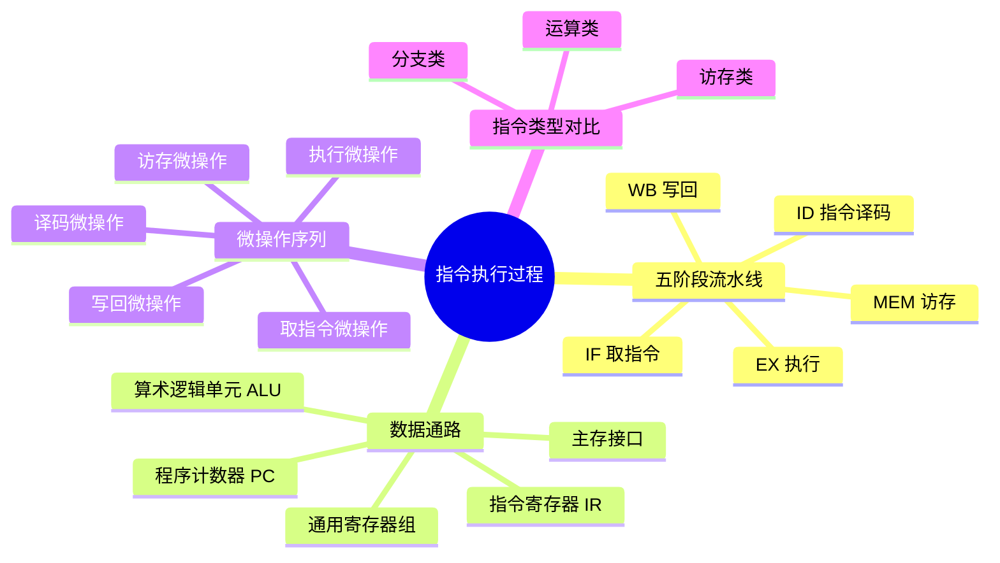

# 计算机：指令执行过程详解

> 📌 重构说明：本笔记按「指令执行五阶段 → 数据通路 → 微操作序列 → 不同指令类型对比」的逻辑链重排，重点讲解了指令在CPU内部的完整执行流程及各阶段对应的硬件组件。

## 🧠 思维导图



---

## 一、指令执行的五阶段模型

### 1.1 阶段概述

一条指令在CPU中的完整执行过程分为五个阶段：

| 阶段 | 英文缩写 | 主要任务 | 涉及硬件 |
|-----|---------|---------|---------|
| 取指令 | IF | 从内存读取指令到IR | PC、主存、IR |
| 指令译码 | ID | 解析指令类型和操作数 | 控制单元、寄存器组 |
| 执行 | EX | 进行算术/逻辑运算或计算地址 | ALU |
| 访存 | MEM | 读写内存中的数据 | 数据缓存/主存 |
| 写回 | WB | 将结果写回寄存器 | 寄存器组 |

> [!info] 补充定义
> 指令周期 = 取指令 + 指令译码 + 执行 + 访存 + 写回。现代CPU通常将五个阶段流水线化，使不同指令的不同阶段并行执行。

### 1.2 取指令阶段 (IF)

取指令阶段的核心任务是**从内存中取出指令**：

1. 将 **PC（程序计数器）** 的值作为地址发送给主存
2. 主存返回该地址对应的指令内容
3. 将指令存入 **IR（指令寄存器）**
4. PC 自增（指向下一条指令）

> [!warning] 考点
> ⚠️ PC的自增逻辑：对于32位（4字节）指令，PC加4；对于16位（2字节）指令，PC加2。跳转指令会在执行阶段修改PC值。

### 1.3 指令译码阶段 (ID)

译码阶段的任务：

1. 解析 IR 中的**操作码**（opcode），确定指令类型（加法、减法、访存等）
2. 解析 **寄存器地址**，从寄存器组中读取源操作数
3. 若为立即数寻址，立即数直接从指令中提取
4. 将解析结果传递给控制单元，为执行阶段做准备

### 1.4 执行阶段 (EX)

执行阶段由 **ALU（算术逻辑单元）** 完成具体运算：

- **运算指令**：进行加法、减法、与、或、异或等运算
- **访存指令**：计算有效地址（基址+偏移量等）
- **分支指令**：判断条件是否满足，决定是否修改PC

### 1.5 访存阶段 (MEM)

访存阶段仅对需要访问内存的指令执行：

- **加载指令（lw）**：从内存读数据到寄存器
- **存储指令（sw）**：将寄存器数据写入内存
- **运算指令**：此阶段为空（无操作）

### 1.6 写回阶段 (WB)

将执行阶段或访存阶段的结果写入**目标寄存器**。

---

## 二、指令执行的数据通路

### 2.1 核心硬件组件

| 组件 | 功能 | 在指令执行中的角色 |
|-----|------|------------------|
| PC | 存放下一条指令的地址 | IF阶段提供指令地址 |
| IR | 存放当前正在执行的指令 | ID阶段提供指令编码 |
| 通用寄存器组 | 存放临时数据和运算结果 | 提供操作数、接收结果 |
| ALU | 执行算术和逻辑运算 | EX阶段完成运算 |
| 控制单元 | 解析指令并生成控制信号 | 协调各阶段工作 |

### 2.2 数据通路的理想特性

- **通用寄存器对称性**：所有通用寄存器可被任意指令使用
- **指令执行的非对称性**：不同指令使用不同阶段的组合
- 运算类指令：IF → ID → EX → WB（不访存）
- 加载指令：IF → ID → EX → MEM → WB（全部五阶段）
- 存储指令：IF → ID → EX → MEM（不写回）

---

## 三、微操作序列

### 3.1 什么是微操作

**微操作**是CPU在一个时钟周期内完成的最小操作单元。一条指令的执行由一系列微操作组成。

### 3.2 各阶段的微操作

**取指令阶段的微操作序列**：
```
1. MAR ← PC           // PC送内存地址寄存器
2. M[MAR] → MDR       // 内存读，指令送数据寄存器
3. MDR → IR           // 指令送指令寄存器
4. PC ← PC + 4        // PC加4（32位指令）
```

**加法指令的微操作序列**（R-type）：
```
1. A ← Reg[rs]        // 读rs源操作数到A寄存器
2. B ← Reg[rt]        // 读rt源操作数到B寄存器
3. ALUOut ← A + B     // ALU执行加法
4. Reg[rd] ← ALUOut   // 结果写回rd寄存器
```

**加载指令的微操作序列**（lw）：
```
1. A ← Reg[rs]        // 读基址
2. ALUOut ← A + imm   // 地址计算
3. M[ALUOut] → MDR    // 从内存读数据
4. Reg[rt] ← MDR      // 数据写回rt寄存器
```

---

## 四、指令类型对比

| 对比维度 | 运算指令 | 访存指令 | 分支指令 |
|---------|---------|---------|---------|
| 执行阶段 | ALU运算 | 地址计算 | 条件判断 |
| 访存阶段 | 无 | 读/写内存 | 无 |
| 写回阶段 | 运算结果写回 | 加载数据写回 | 无 |
| PC更新 | PC+4 | PC+4 | 条件满足则跳转 |
| 所需周期 | 较少 | 较多 | 取决于分支预测 |

> [!tip] 思考题
> 为什么存储指令不需要写回阶段？因为存储指令的目标是内存而非寄存器，MEM阶段已经将数据写入内存，无需回写。

---

## 🔗 知识网络

### 前置依赖
- [[计算机层次结构与指令集]] — ISA是软件和硬件的接口
- [[指令格式与数据传送]] — 指令的编码格式和寻址方式
- [[计算机硬件组成与总线]] — CPU内部组件的基本认识

### 后续延伸
- [[流水线技术]] — 五阶段并行执行提升性能
- [[流水线冒险]] — 数据冒险、控制冒险、结构冒险
- [[分支预测]] — 提高流水线效率的关键技术

### 对比辨析
- 运算指令 vs 访存指令：前者用ALU处理寄存器数据，后者计算地址后访问内存
- 指令周期 vs 时钟周期：一条指令周期包含多个时钟周期

---

## 📚 核心词条索引

| 知识点链接 | 类别 | 关键词 |
|------|------|--------|
| [[指令周期]] | 核心概念 | CPU执行一条指令所需的时间 |
| [[取指令]] | 执行阶段 | 从内存读取指令到IR的过程 |
| [[指令译码]] | 执行阶段 | 解析指令的操作码和操作数 |
| [[数据通路]] | 硬件组件 | 数据在CPU各组件间的传输路径 |
| [[微操作]] | 执行细节 | 一个时钟周期内的最小操作单元 |
| [[程序计数器PC]] | 硬件组件 | 存放下一条指令的地址 |
| [[指令寄存器IR]] | 硬件组件 | 存放当前正在执行的指令 |