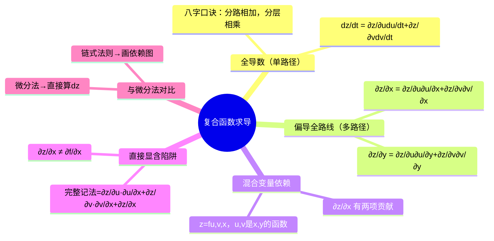

# 高等数学：多元复合函数求导法则

> 📌 重构说明：本笔记是高等数学下册求导的大招——链式法则。已按「全导数公式（$dz/dt = \frac{\partial z}{\partial u}\frac{du}{dt}+\frac{\partial z}{\partial v}\frac{dv}{dt}$ 八字口诀：分路相加，分层相乘）→有分支（中间变量为二元：$\partial z/\partial x = \frac{\partial z}{\partial u}\frac{\partial u}{\partial x}+\frac{\partial z}{\partial v}\frac{\partial v}{\partial x}$）→混合情形（中间变量既是 $x$ 的函数也显含 $x$）→抽象记号陷阱（$\partial z/\partial x$ vs $\partial f/\partial x$ 的区别）→与微分法的效率对比（链式法则 vs 全微分法）」的逻辑链重排。完整保留了全导数八字口诀、变量依赖图、四种典型题目模型的抽象函数求导以及常犯的「$\partial f$ 缺下标记」错误。

## 🧠 思维导图

---

## 一、全导数——分支变量不同

**情形**：$z = f(u,v)$，$u=u(t), v=v(t)$

$$\boxed{\frac{dz}{dt} = \frac{\partial z}{\partial u}\cdot\frac{du}{dt} + \frac{\partial z}{\partial v}\cdot\frac{dv}{dt}}$$

==八字口诀==：**分路相加，分层相乘**。

> 📖 直观理解：$z$ 通过 $u$ 和 $v$ 两条路径影响 $t$，每条路径的贡献 = 偏导（距离的最小变化率）× 路径末端的导数（速率）。

---

## 二、中间变量多元——偏导数支路

**情形**：$z = f(u,v)$，$u=u(x,y), v=v(x,y)$

$$\boxed{\frac{\partial z}{\partial x} = \frac{\partial z}{\partial u}\cdot\frac{\partial u}{\partial x} + \frac{\partial z}{\partial v}\cdot\frac{\partial v}{\partial x}}$$

$$\frac{\partial z}{\partial y} = \frac{\partial z}{\partial u}\cdot\frac{\partial u}{\partial y} + \frac{\partial z}{\partial v}\cdot\frac{\partial v}{\partial y}$$

==画变量依赖图==：从目标变量到 $z$，每找到一条不同路径就添加一项。

---

## 三、混合变量依赖——不可缺项的陷阱

**情形**：$z = f(u,v,x)$，$u,v$ 又都是 $x,y$ 的函数。

求 $\partial z/\partial x$ 时：

$$\frac{\partial z}{\partial x} = \frac{\partial z}{\partial u}\cdot\frac{\partial u}{\partial x} + \frac{\partial z}{\partial v}\cdot\frac{\partial v}{\partial x} + \boxed{\frac{\partial z}{\partial x}}$$

==第三项==：$z$ 对显含的 $x$ 直接求偏导。

> [!warning] 考点
> ⚠️ 常见错误：看到 $z=f(u,v,x)$ 求 $\partial z/\partial x$，只写了中间变量的链式，漏了直接偏导项 $f_x$。正确的是三元之和。

### 抽象记号辨析

==$\frac{\partial z}{\partial x}$ 不等于 $\frac{\partial f}{\partial x}$！==

- $\frac{\partial z}{\partial x}$ = $z$ 对变量 $x$ 的全偏导（通过中间变量 + 直接显含）
- $\frac{\partial f}{\partial x}$ = 在 $f$ 的括号内对第三个变量位置的偏导（纯函数关系的部分，也叫 $f_3$）

---

## 四、微分法与链式法则对比

| 方法 | 操作 | 优势 |
|------|------|------|
| 链式法则 | 画依赖图 → 逐路相加 | 理解层次关系 |
| 微分法 | 直接求 $dz$ → 提取 $dx$ 系数 | ==一举两得（$x$ 和 $y$ 的偏导一起出）== |

---

---

## 🔗 知识网络

### 前置依赖
- 02_偏导数与全微分 — 偏导数的基本计算
- 01_求导法则与基本公式 — 一元复合函数求导链式法则

### 后续应用
- 04_隐函数求导 — 隐函数定理的推导
- 05_隐函数组求导 — 多方程隐函数组的求导
- 06_多元函数的极值与条件极值 — 极值问题的求解

### 对比辨析
- 全导数 vs 偏导数：全导数 $dz/dt$ 是复合函数对最终变量的变化率（只有一个中间路径），偏导数 $\partial z/\partial x$ 要考虑所有包含 x 的路径
- 树形图法：画出变量依赖树→每个路径求导相乘→同层路径相加——这是链式法则最直观的记忆方式

## 📚 核心词条索引

| 知识点链接 | 类别 | 关键词 |
|------|------|--------|
| [[变量依赖图]] | 辅助工具 | 画图表示变量间的依赖关系，帮助确定链式法则的路径 |
| [[链式法则]] | 核心公式 | 分路相加、分层相乘，求复合函数偏导的方法 |
| [[全导数]] | 核心概念 | $dz/dt=\partial z/\partial u\cdot du/dt+\partial z/\partial v\cdot dv/dt$ |
| [[全微分]] | 核心概念 | $dz=\partial z/\partial x\cdot dx+\partial z/\partial y\cdot dy$ |
