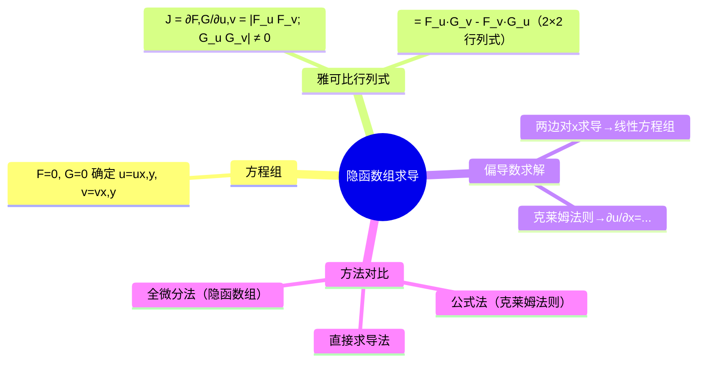

# 高等数学：隐函数组求导

> 📌 重构说明：本笔记是把隐函数求导推向「方程组」的高阶战场。已按「隐函数组的存在定理（$\{F(x,y,u,v)=0,G(x,y,u,v)=0\}$ 确定 $u(x,y),v(x,y)$→雅可比行列式 $J=\frac{\partial(F,G)}{\partial(u,v)}\neq0$）→两方程两未知函数的求解（克莱姆法则→型如 $\partial u/\partial x$ 的公式）→原笔记例题完整呈现（令 $x$ 为自变量时的两种策略：直接求导 / 全微分法（隐函数组））」的逻辑链重排。完整保留了雅可比行列式的计算和方程组求导的推导步骤。

## 🧠 思维导图

---

## 一、隐函数组的存在定理

方程组：
$$\begin{cases} F(x, y, u, v) = 0 \\ G(x, y, u, v) = 0 \end{cases}$$

确定隐函数 $u=u(x,y), v=v(x,y)$。

条件：==雅可比行列式不为零==。

---

## 二、雅可比行列式

$$\boxed{J = \frac{\partial(F,G)}{\partial(u,v)} = \begin{vmatrix} F_u & F_v \\ G_u & G_v \end{vmatrix} = F_u G_v - F_v G_u \neq 0}$$

$J\neq 0$ → 两方程独立 → 能唯一解出 $u,v$。

> 📖 类比：你可以把雅可比行列式理解为「多变量变化率」。2×2 的行列式 = 两个偏导向量的面积量，排除退化情况（一行全零 = 退活跃方程）。

---

## 三、偏导数求解

### 直接求导法

两边对 $x$ 求偏导（$u,v$ 是 $x,y$ 的函数，$y$ 在求 $\partial/\partial x$ 时视作常数）：

$$\begin{cases} F_x + F_u \frac{\partial u}{\partial x} + F_v \frac{\partial v}{\partial x} = 0 \\[4pt] G_x + G_u \frac{\partial u}{\partial x} + G_v \frac{\partial v}{\partial x} = 0 \end{cases}$$

→ 关于 $\frac{\partial u}{\partial x},\frac{\partial v}{\partial x}$ 的二元一次方程组。

### 克莱姆法则

$$\frac{\partial u}{\partial x} = -\frac{\begin{vmatrix} F_x & F_v \\ G_x & G_v \end{vmatrix}}{J},\quad \frac{\partial v}{\partial x} = -\frac{\begin{vmatrix} F_u & F_x \\ G_u & G_x \end{vmatrix}}{J}$$

规律：分母永远是 $J$，分子 = 把 $J$ 中对应的偏导列替换为 $(F_x,G_x)^T$。

### 全微分法

直接对 $F=0$ 和 $G=0$ 两边取全微分 → 两个关于 $du,dv$ 的线性方程 → 解出 $du,dv$ → 提取对应的 $dx$ 和 $dy$ 系数。

---

---

## 🔗 知识网络

### 前置依赖
- 04_隐函数求导 — 单方程隐函数求导
- 03_多元复合函数求导法则 — 链式求导法则
- [[行列式]] — 雅可比行列式的计算

### 后续应用
- 06_多元函数的极值与条件极值 — 条件极值中隐函数组的处理
- 02_格林公式及其应用 — 坐标变换中的雅可比行列式

### 对比辨析
- 隐函数 vs 隐函数组：隐函数 $F(x,y)=0$ 确定一个因变量，隐函数组 $\{F(x,y,u,v)=0, G(x,y,u,v)=0\}$ 确定两个因变量
- 雅可比行列式 $J=\partial(u,v)/\partial(x,y)$ 不为零 → 隐函数组存在——这是隐函数组定理的核心条件

## 📚 核心词条索引

| 知识点链接 | 类别 | 关键词 |
|------|------|--------|
| [[克莱姆法则]] | 求解方法 | 用行列式求解线性方程组的方法 |
| [[全微分法（隐函数组）]] | 求解方法 | 对方程组两边取全微分，解出du,dv |
| [[雅可比行列式]] | 核心概念 | $J=\partial(F,G)/\partial(u,v)$，判断隐函数组是否存在 |
| [[隐函数求导]] | 核心方法 | 方程两边对自变量求导，解出隐函数的导数 |
| [[隐函数组]] | 核心概念 | 方程组确定的多个隐函数 |
