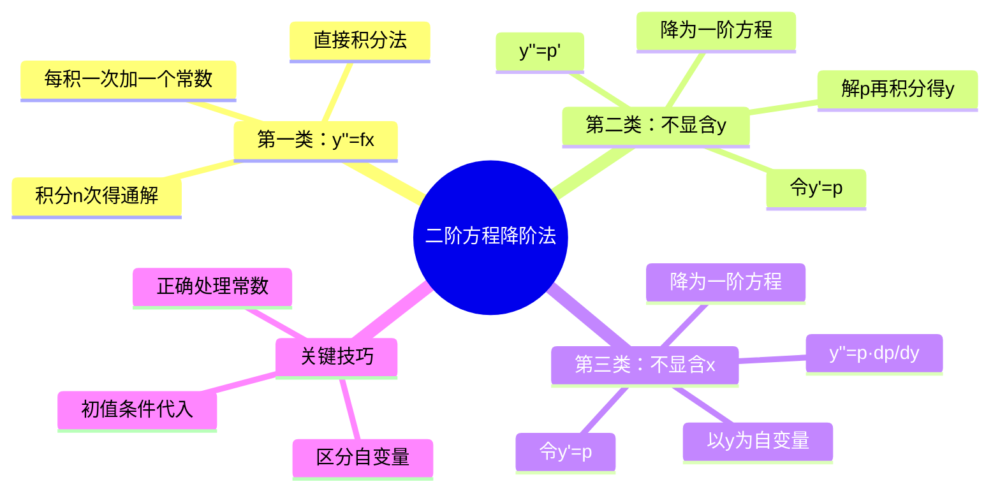

# 高等数学：二阶微分方程降阶法

> 📌 重构说明：本笔记将多段课堂录音按「可降阶类型分类→换元技巧→计算流程→例题示范」的逻辑链重排，重点讲解三类可降阶的二阶方程及其对应换元策略。

## 🧠 思维导图

---

## 一、第一类：y'' = f(x) 型（直接积分型）

### 1.1 形式与特征

方程形式：$\boxed{y^{(n)} = f(x)}$

左边是未知函数的n阶导数，右边是仅关于x的已知函数。

### 1.2 解法：直接积分法

令 $z = y^{(n-1)}$，则原方程降为：
$$\frac{dz}{dx} = f(x)$$

这是一个变量可分离的一阶方程，两边直接积分：
$$z = \int f(x) dx + C_1$$

代回 $z = y^{(n-1)}$，继续积分，每积一次加一个常数，积分n次即得通解。

> [!warning] 考点
> ⚠️ 每积分一次必须加一个积分常数！积分n次得到n个任意常数，恰好与阶数匹配。

### 1.3 典型例题

> [!example] 例题1：求解三阶方程 $y''' = e^x - \sin x$
> **已知条件**：$y''' = e^x - \sin x$
> **求解目标**：求通解 $y(x)$
> **关键步骤**：
> 1. $y'' = \int (e^x - \sin x)dx = e^x + \cos x + C_1$
> 2. $y' = \int (e^x + \cos x + C_1)dx = e^x + \sin x + C_1x + C_2$
> 3. $y = \int (e^x + \sin x + C_1x + C_2)dx = e^x - \cos x + \frac{C_1}{2}x^2 + C_2x + C_3$
> **答案**：$y = e^x - \cos x + C_1x^2 + C_2x + C_3$（常数重新标记）

---

## 二、第二类：不显含未知函数 y 型

### 2.1 形式与特征

方程形式：$\boxed{F(x, y', y'') = 0}$

方程中含有x、y'、y''，但**不显含y**。

### 2.2 解法：令 y' = p

令 $p = y' = \frac{dy}{dx}$，则 $y'' = \frac{dp}{dx} = p'$

原方程降为一阶方程：
$$F(x, p, p') = 0$$

解出 $p = \varphi(x, C_1)$，再积分：
$$y = \int \varphi(x, C_1) dx + C_2$$

> [!tip] 技巧
> 解出p后得到的是 $p = p(x)$ 的关系，回到 $y' = p(x)$，这是变量可分离方程，直接积分即得y。

### 2.3 典型例题

> [!example] 例题2：求解初值问题 $(1+x^2)y'' = 2xy'$，$y(0)=1$，$y'(0)=3$
> **已知条件**：$(1+x^2)y'' = 2xy'$，$y(0)=1$，$y'(0)=3$
> **求解目标**：求特解
> **关键步骤**：
> 1. 令 $p = y'$，则 $y'' = p'$，原方程化为 $(1+x^2)p' = 2xp$
> 2. 分离变量：$\frac{dp}{p} = \frac{2x}{1+x^2}dx$
> 3. 两边积分：$\ln|p| = \ln(1+x^2) + \ln C_1$，得 $p = C_1(1+x^2)$
> 4. 代入初值 $y'(0)=3$：$3 = C_1 \cdot 1$，得 $C_1 = 3$
> 5. $y' = 3(1+x^2)$，积分得 $y = 3x + x^3 + C_2$
> 6. 代入 $y(0)=1$：$1 = 0 + 0 + C_2$，得 $C_2 = 1$
> **答案**：$y = x^3 + 3x + 1$

---

## 三、第三类：不显含自变量 x 型

### 3.1 形式与特征

方程形式：$\boxed{F(y, y', y'') = 0}$

方程中含有y、y'、y''，但**不显含x**。

### 3.2 解法：令 y' = p，以 y 为自变量

令 $p = y' = \frac{dy}{dx}$，利用复合函数求导法则：
$$y'' = \frac{dp}{dx} = \frac{dp}{dy} \cdot \frac{dy}{dx} = p \frac{dp}{dy}$$

原方程降为一阶方程：
$$F\left(y, p, p\frac{dp}{dy}\right) = 0$$

解出 $p = \varphi(y, C_1)$，再由 $\frac{dy}{dx} = \varphi(y, C_1)$ 分离变量得：
$$\frac{dy}{\varphi(y, C_1)} = dx$$
两边积分即得通解。

### 3.3 典型例题

> [!example] 例题3：求解方程 $yy'' = (y')^2$，满足 $y(0)=1$，$y'(0)=1$
> **已知条件**：$yy'' = (y')^2$，$y(0)=1$，$y'(0)=1$
> **求解目标**：求曲线 $y(x)$
> **关键步骤**：
> 1. 不显含x，令 $y' = p$，则 $y'' = p\frac{dp}{dy}$
> 2. 代入：$y \cdot p\frac{dp}{dy} = p^2$
> 3. 由 $y'(0)=1$ 知 $p \neq 0$，两边除以p：$y\frac{dp}{dy} = p$
> 4. 分离变量：$\frac{dp}{p} = \frac{dy}{y}$
> 5. 积分得 $\ln|p| = \ln|y| + \ln C_1$，即 $p = C_1 y$
> 6. 由 $y(0)=1$，$y'(0)=p(0)=1$：$1 = C_1 \cdot 1$，得 $C_1 = 1$
> 7. 所以 $y' = y$，分离变量 $\frac{dy}{y} = dx$
> 8. 积分得 $\ln|y| = x + C_2$，即 $y = e^{x+C_2} = C_2 e^x$
> 9. 代入 $y(0)=1$：$1 = C_2$，得 $C_2 = 1$
> **答案**：$y = e^x$

> [!warning] 考点
> ⚠️ 第三类（不显含x）的关键步骤是 $y'' = p\frac{dp}{dy}$，与第二类（不显含y）的 $y'' = p'$ 不同！两类换元方式不能混淆。

---

## 🔗 知识网络

### 前置依赖
- [[微分方程的概念与分类]] — 理解阶数、通解/特解的概念
- [[一阶微分方程——变量分离与齐次方程]] — 降阶后的求解基础
- [[复合函数求导法则]] — 第三类降阶的数学基础

### 后续延伸
- [[常系数微分方程解法]] — 另一类重要的二阶方程解法
- [[高阶线性微分方程解的结构]] — 从降阶到线性结构

### 对比辨析
- 第二类（不显含y）vs 第三类（不显含x）：前者 $y'' = p'$，后者 $y'' = p\frac{dp}{dy}$
- 直接积分型 vs 换元降阶型：前者直接积分，后者需换元

---

## 📚 核心词条索引

| 知识点链接 | 类别 | 关键词 |
|------|------|--------|
| [[降阶法]] | 核心方法 | 将高阶方程转化为一阶方程的换元技术 |
| [[不显含y]] | 方程类型 | 方程中无y，令 y'=p，y''=p' |
| [[不显含x]] | 方程类型 | 方程中无x，令 y'=p，y''=p·dp/dy |
| [[直接积分法]] | 求解方法 | n次积分得通解，每积一次加一个常数 |