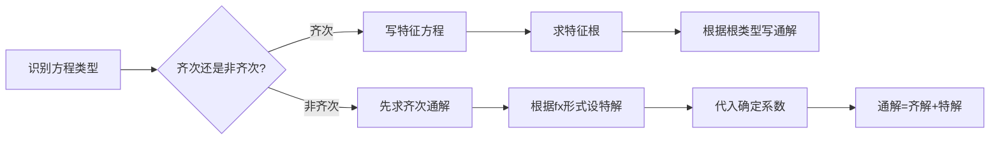

# 高等数学：常系数微分方程解法

> 📌 重构说明：本笔记将「常系数齐次线性方程→特征方程→通解形式（三种特征根情况）→常系数非齐次线性方程→待定系数法」按知识递进逻辑重排，完整保留了齐次解与非齐次特解的求解流程及典型例题。

## 🧠 思维导图

```mermaid
mindmap
  root((常系数微分方程))
    基本形式
      齐次：y''+py'+qy=0
      非齐次：y''+py'+qy=fx
    齐次解法
      特征方程 r^2+pr+q=0
      两不等实根
      两相等实根
      共轭复根
    非齐次解法
      先求齐次通解
      再求非齐次特解
      待定系数法
    待定系数法
      f(x)=e^λx Pm(x)
      f(x)=e^λx[Acosβx+Bsinβx]
      特解形式与λ是否重根相关
```

---

## 一、基本概念

### 1.1 常系数线性微分方程的定义

**二阶常系数线性微分方程**的一般形式：
$$\boxed{y'' + p y' + q y = f(x)}$$

其中 $p, q$ 为常数。若 $f(x) \equiv 0$，称为**齐次方程**；若 $f(x) \neq 0$，称为**非齐次方程**。

### 1.2 解的结构定理

> [!info] 核心定理
> 非齐次方程的通解 = 对应齐次方程的通解 + 非齐次方程的一个特解
> $$y_{\text{通}} = y_{\text{齐}} + y^*$$

---

## 二、齐次方程解法：特征方程法

### 2.1 特征方程的建立

对于方程 $y'' + p y' + q y = 0$，设 $y = e^{rx}$，代入得：
$$r^2 e^{rx} + p r e^{rx} + q e^{rx} = 0$$

除以 $e^{rx} \neq 0$ 得到**特征方程**：
$$\boxed{r^2 + p r + q = 0}$$

### 2.2 三种情况

| 特征根情况 | 通解形式 |
|-----------|---------|
| 两不等实根 $r_1 \neq r_2$ | $y = C_1 e^{r_1 x} + C_2 e^{r_2 x}$ |
| 两相等实根 $r_1 = r_2 = r$ | $y = (C_1 + C_2 x) e^{r x}$ |
| 共轭复根 $r_{1,2} = \alpha \pm i\beta$ | $y = e^{\alpha x}(C_1 \cos\beta x + C_2 \sin\beta x)$ |

> [!warning] 考点
> ⚠️ 重根情况必须乘 $x$！很多同学在二重根时忘记乘 $x$，导致特解形式错误。推广到n阶：k重根 $r$ 对应因子 $(C_1 + C_2 x + \cdots + C_k x^{k-1}) e^{rx}$。

### 2.3 典型例题

> [!example] 例题1：求解 $y'' - 3y' + 2y = 0$
> **已知条件**：$y'' - 3y' + 2y = 0$
> **求解目标**：求通解
> **关键步骤**：
> 1. 特征方程：$r^2 - 3r + 2 = 0$
> 2. 因式分解：$(r-1)(r-2) = 0$，得 $r_1 = 1, r_2 = 2$
> 3. 两不等实根，通解为 $y = C_1 e^{x} + C_2 e^{2x}$
> **答案**：$y = C_1 e^{x} + C_2 e^{2x}$

> [!example] 例题2：求解 $y'' - 4y' + 4y = 0$
> **已知条件**：$y'' - 4y' + 4y = 0$
> **求解目标**：求通解
> **关键步骤**：
> 1. 特征方程：$r^2 - 4r + 4 = 0$
> 2. 完全平方：$(r-2)^2 = 0$，得 $r_1 = r_2 = 2$（二重根）
> 3. 通解为 $y = (C_1 + C_2 x) e^{2x}$
> **答案**：$y = (C_1 + C_2 x) e^{2x}$

> [!example] 例题3：求解 $y'' + 2y' + 5y = 0$
> **已知条件**：$y'' + 2y' + 5y = 0$
> **求解目标**：求通解
> **关键步骤**：
> 1. 特征方程：$r^2 + 2r + 5 = 0$
> 2. 求根公式：$r = \frac{-2 \pm \sqrt{4-20}}{2} = -1 \pm 2i$
> 3. $\alpha = -1, \beta = 2$，通解为 $y = e^{-x}(C_1 \cos 2x + C_2 \sin 2x)$
> **答案**：$y = e^{-x}(C_1 \cos 2x + C_2 \sin 2x)$

---

## 三、非齐次方程解法：待定系数法

### 3.1 核心思想

对于 $y'' + p y' + q y = f(x)$，解法分两步：
1. 解齐次方程，得 $y_{\text{齐}}$
2. 根据 $f(x)$ 形式，设特解 $y^*$，代入原方程确定系数

### 3.2 常见 $f(x)$ 形式的特解设法

**类型一**：$f(x) = P_m(x) e^{\lambda x}$（多项式乘指数）

设特解形式：
$$y^* = x^k \cdot Q_m(x) \cdot e^{\lambda x}$$

其中 $k$ 的取值为：
- $k = 0$：$\lambda$ 不是特征根
- $k = 1$：$\lambda$ 是单特征根
- $k = 2$：$\lambda$ 是二重特征根

$Q_m(x)$ 是与 $P_m(x)$ 同次($m$次)的多项式，系数待定。

**类型二**：$f(x) = e^{\lambda x}[A\cos\beta x + B\sin\beta x]$

设特解形式：
$$y^* = x^k \cdot e^{\lambda x}[C\cos\beta x + D\sin\beta x]$$

其中 $k = 0$（若 $\lambda + i\beta$ 不是特征根）或 $k = 1$（若 $\lambda + i\beta$ 是特征根）。

### 3.3 典型例题

> [!example] 例题4：求 $y'' - 2y' - 3y = 3x + 1$ 的一个特解
> **已知条件**：$y'' - 2y' - 3y = 3x + 1$
> **求解目标**：求特解 $y^*$
> **关键步骤**：
> 1. $f(x) = 3x + 1$，属 $P_m(x)e^{\lambda x}$ 型，$\lambda = 0, m = 1$
> 2. 特征方程 $r^2 - 2r - 3 = 0$，根为 $r_1 = -1, r_2 = 3$
> 3. $\lambda = 0$ 不是特征根，$k = 0$
> 4. 设 $y^* = ax + b$
> 5. 代入：$y^{*\prime} = a$，$y^{*\prime\prime} = 0$
> 6. $0 - 2a - 3(ax + b) = -3ax + (-2a - 3b) = 3x + 1$
> 7. 对比系数：$\begin{cases} -3a = 3 \\ -2a - 3b = 1 \end{cases}$，得 $a = -1, b = \frac{1}{3}$
> **答案**：$y^* = -x + \frac{1}{3}$

> [!example] 例题5：求 $y'' - 2y' - 3y = e^{-x}$ 的一个特解
> **已知条件**：$y'' - 2y' - 3y = e^{-x}$
> **求解目标**：求特解 $y^*$
> **关键步骤**：
> 1. $f(x) = e^{-x}$，$\lambda = -1, m = 0$
> 2. 特征根 $r_1 = -1, r_2 = 3$
> 3. $\lambda = -1$ 是单特征根，$k = 1$
> 4. 设 $y^* = ax e^{-x}$（必须乘 $x$！）
> 5. 代入得 $a = -\frac{1}{4}$
> **答案**：$y^* = -\frac{1}{4}x e^{-x}$

---

## 四、解题流程总结



> [!tip] n阶推广
> n阶常系数线性齐次方程的特征方程为 $r^n + a_1r^{n-1} + \cdots + a_{n-1}r + a_n = 0$。k重根 $r$ 对应因子 $(C_1 + C_2 x + \cdots + C_k x^{k-1})e^{rx}$。

---

## 🔗 知识网络

### 前置依赖
- [[微分方程的概念与分类]] — 理解方程阶数、线性等基本概念
- [[一阶线性微分方程与常数变易法]] — 常数变易法的预备知识
- [[降阶法]] — 二阶方程的另一类解法

### 后续延伸
- [[高阶线性微分方程解的结构]] — 从二阶推广到n阶的理论框架
- [[常系数非齐次线性方程]] — 特解形式的系统化方法

### 对比辨析
- 齐次 vs 非齐次：前者 $f(x)=0$，后者 $f(x)\neq 0$
- 特征根法 vs 待定系数法：前者解齐次，后者解非齐次

---

## 📚 核心词条索引

| 知识点链接 | 类别 | 关键词 |
|------|------|--------|
| [[特征方程]] | 核心方法 | 将微分方程转化为代数方程求解 |
| [[特征根法]] | 核心方法 | 通过特征根直接写出齐次通解 |
| [[待定系数法]] | 核心方法 | 根据f(x)形式设特解，代入确定系数 |
| [[常系数线性微分方程]] | 方程类型 | p,q为常数的线性微分方程 |
| [[齐次解]] | 核心概念 | 对应齐次方程的通解 |
| [[非齐次特解]] | 核心概念 | 非齐次方程的任意一个特解 |