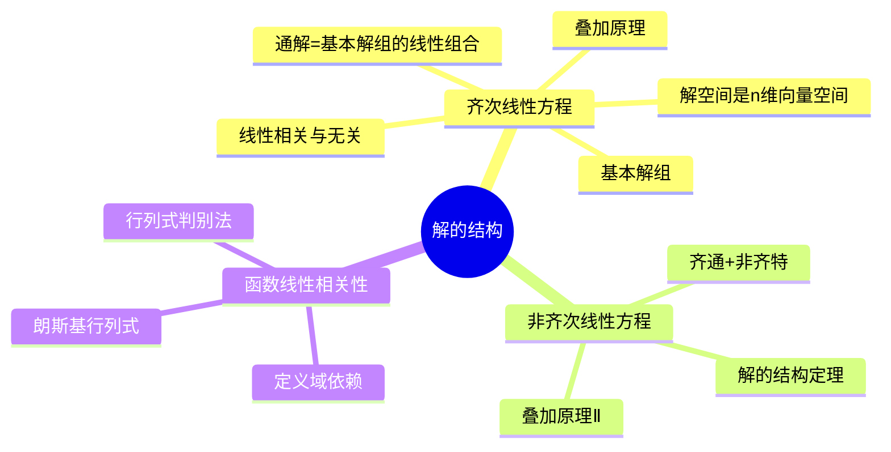

# 高等数学：高阶线性微分方程解的结构

> 📌 重构说明：本笔记将「解的存在唯一性→齐次解的结构（叠加原理、线性相关/无关、基本解组）→非齐次解的结构（齐解+特解、叠加原理Ⅱ）」按理论递进逻辑重排，重点梳理n阶线性微分方程解空间的理论框架。

## 🧠 思维导图



---

## 一、n阶线性微分方程的一般形式

### 1.1 基本形式

**n阶线性微分方程**：
$$\boxed{y^{(n)} + a_1(x) y^{(n-1)} + \cdots + a_{n-1}(x) y' + a_n(x) y = f(x)}$$

若 $f(x) \equiv 0$，称为**n阶齐次线性方程**；若 $f(x) \not\equiv 0$，称为**n阶非齐次线性方程**。

> [!info] 补充定义
> 线性性体现在：方程左边是 $y$ 及其各阶导数的线性组合（系数仅依赖于 $x$），不含 $y^2$、$\sin y$、$y \cdot y'$ 等非线性项。

### 1.2 解的存在唯一性定理

若系数 $a_i(x)$ 和 $f(x)$ 在区间 $I$ 上连续，则对任意 $x_0 \in I$ 和任意初值 $y_0, y_0', \cdots, y_0^{(n-1)}$，方程在 $I$ 上存在唯一解。

---

## 二、齐次线性方程解的结构

### 2.1 叠加原理

> [!info] 叠加原理（原理Ⅰ）
> 若 $y_1, y_2, \cdots, y_k$ 是齐次方程的$k$个解，则它们的任意线性组合 $C_1 y_1 + C_2 y_2 + \cdots + C_k y_k$ 也是该齐次方程的解。

**证明要点**：将线性组合代入方程，利用齐次方程 $L[y]=0$ 的线性性质：
$$L[C_1 y_1 + \cdots + C_k y_k] = C_1 L[y_1] + \cdots + C_k L[y_k] = 0$$

### 2.2 函数的线性相关与无关

**定义**：函数组 $y_1, y_2, \cdots, y_n$ 在区间 $I$ 上称为线性相关，若存在不全为零的常数 $C_1, C_2, \cdots, C_n$，使得：
$$C_1 y_1(x) + C_2 y_2(x) + \cdots + C_n y_n(x) \equiv 0, \quad \forall x \in I$$

否则称为线性无关。

> [!warning] 考点
> ⚠️ 函数的线性相关性与向量不同：函数线性相关要求在区间上**处处为零**，而不是在某点为零。两个函数若成比例则线性相关；若不成比例（比值不是常数）则线性无关。

### 2.3 朗斯基行列式

对于 $n$ 个 $n-1$ 阶可微函数，朗斯基行列式定义为：
$$W(y_1, \cdots, y_n) = \begin{vmatrix}
y_1 & y_2 & \cdots & y_n \\
y_1' & y_2' & \cdots & y_n' \\
\vdots & \vdots & \ddots & \vdots \\
y_1^{(n-1)} & y_2^{(n-1)} & \cdots & y_n^{(n-1)}
\end{vmatrix}$$

**判别定理**：若 $W(x_0) \neq 0$ 对某 $x_0 \in I$ 成立，则 $y_1, \cdots, y_n$ 在 $I$ 上线性无关；若 $W(x) \equiv 0$ 且在 $I$ 上某点各阶导数不全为零，则线性相关。

### 2.4 基本解组与通解结构

**基本解组**：$n$ 阶齐次线性方程的 $n$ 个线性无关的解称为该方程的一个基本解组。

**通解结构定理**：若 $y_1, y_2, \cdots, y_n$ 是 $n$ 阶齐次线性方程的一个基本解组，则齐次方程的通解为：
$$\boxed{y_{\text{齐}} = C_1 y_1 + C_2 y_2 + \cdots + C_n y_n}$$

其中 $C_1, C_2, \cdots, C_n$ 为任意常数。

**解空间**：n阶齐次线性方程的所有解构成一个n维线性空间，基本解组就是该空间的一组基。

> [!tip] 与线性代数的联系
> 解空间的维数 = 方程阶数 = n。这个结论与常系数还是变系数无关，只取决于方程的线性性质。

---

## 三、非齐次线性方程解的结构

### 3.1 通解结构定理

> [!info] 核心定理
> n阶非齐次线性方程 $L[y] = f(x)$ 的通解等于对应齐次方程 $L[y] = 0$ 的通解加上非齐次方程的一个特解：
> $$\boxed{y_{\text{通}} = y_{\text{齐}} + y^*}$$
> 其中 $y_{\text{齐}} = C_1 y_1 + \cdots + C_n y_n$，$y^*$ 是原非齐次方程的任意一个特解。

**证明思路**：设 $y$ 是任一非齐次解，$y^*$ 是已知的一个非齐次解，则 $(y - y^*)$ 满足齐次方程，因此可表示为基本解组的线性组合。

### 3.2 叠加原理Ⅱ

> [!info] 叠加原理（原理Ⅱ）
> 若 $y_1^*$ 是 $L[y] = f_1(x)$ 的解，$y_2^*$ 是 $L[y] = f_2(x)$ 的解，则 $y_1^* + y_2^*$ 是 $L[y] = f_1(x) + f_2(x)$ 的解。

**应用价值**：当 $f(x)$ 由多项组成（如 $f(x) = e^x + \sin x$）时，可分别求特解再相加。

### 3.3 典型例题

> [!example] 例题1：验证解的结构定理
> **已知条件**：已知二阶非齐次方程 $y'' - 3y' + 2y = e^x$ 的两个特解为 $y_1^* = -xe^x$，$y_2^* = -xe^x + e^x$
> **求解目标**：写出方程的通解
> **关键步骤**：
> 1. 两特解之差 $y_2^* - y_1^* = e^x$ 是齐次方程的解
> 2. 齐次方程的特征方程 $r^2 - 3r + 2 = 0$，根 $r_1 = 1, r_2 = 2$
> 3. 齐次通解 $y_{\text{齐}} = C_1 e^x + C_2 e^{2x}$
> 4. 非齐次通解 $y = C_1 e^x + C_2 e^{2x} - xe^x$
> **答案**：$y = C_1 e^x + C_2 e^{2x} - xe^x$

> [!example] 例题2：验证叠加原理Ⅱ
> **已知条件**：$y_1^* = -x$ 是 $y'' - 3y' + 2y = 3x - 2$ 的特解，$y_2^* = - \frac{1}{4}x e^x$ 是 $y'' - 3y' + 2y = e^{-x}$ 的特解
> **求解目标**：求 $y'' - 3y' + 2y = 3x - 2 + e^{-x}$ 的一个特解
> **关键步骤**：
> 1. 由叠加原理Ⅱ，$y^* = y_1^* + y_2^* = -x - \frac{1}{4}x e^x$
> 2. 代入验证即为方程的解
> **答案**：$y^* = -x - \frac{1}{4}x e^x$

---

## 四、知识脉络总结

```mermaid
flowchart TD
    A[n阶线性微分方程] --> B{齐次还是非齐次?}
    B -->|齐次 L[y]=0| C[叠加原理Ⅰ]
    C --> D[基本解组：n个线性无关解]
    D --> E[通解 = 基本解组的线性组合]
    B -->|非齐次 L[y]=f| F[先求齐次通解]
    F --> G[再找一个非齐次特解]
    G --> H[通解 = 齐通 + 非齐特]
    H --> I[叠加原理Ⅱ：f可分解为f1+f2]
    I --> J[对应特解分别求后相加]
```

---

## 🔗 知识网络

### 前置依赖
- [[微分方程的概念与分类]] — 理解线性、阶数等基础概念
- [[常系数微分方程解法]] — 特征根法求具体齐次通解
- [[降阶法]] — 高阶方程求解的另一途径
- [[线性代数中的线性相关]] — 理解函数线性相关性的基础

### 后续延伸
- [[常数变易法]] — 已知齐次通解求非齐次特解的一般方法
- [[待定系数法]] — 根据f(x)形式求特解

### 对比辨析
- 函数线性相关 vs 向量线性相关：函数要求区间上处处为零，向量要求线性组合为零
- 齐次通解（含n个独立解）vs 非齐次通解（齐通+特解）

---

## 📚 核心词条索引

| 知识点链接 | 类别 | 关键词 |
|------|------|--------|
| [[叠加原理]] | 核心定理 | 解的线性组合仍是齐次解 |
| [[基本解组]] | 核心概念 | n个线性无关解的集合 |
| [[朗斯基行列式]] | 判定工具 | 判别函数线性相关的行列式 |
| [[线性相关与无关]] | 核心概念 | 函数之间是否成比例/线性表出 |
| [[解空间]] | 核心概念 | 齐次方程所有解构成n维线性空间 |